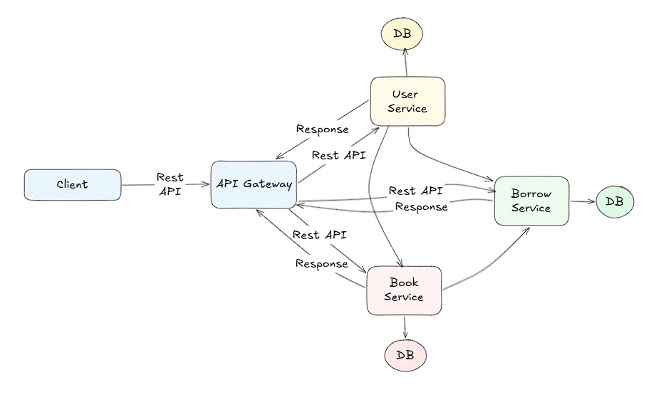

# Library Management Service (Version I)
A Python-based microservices project for managing books, borrowing, and user authentication.

## System Architecture

  

## Services

- `bookservice`
  - Manages book inventory and book-related operations.
  - FastAPI service with PostgreSQL persistence.
- `borrowservice`
  - Handles borrow, return, and fine payment logic.
  - FastAPI service with PostgreSQL persistence.
- `userservice`
  - Handles user registration, login, and account management.
  - FastAPI service with PostgreSQL persistence.
- `gateway`
  - API gateway service that routes client requests to the backend services.
  - Proxies REST requests and centralizes service access.

## Structure

Each service contains:

- `src/` — application source code
- `requirements.txt` — service dependencies
- `config/.env` — environment configuration (local settings)

## Run locally

1. Install dependencies for each service:
   - `cd services/bookservice && pip install -r requirements.txt`
   - `cd services/borrowservice && pip install -r requirements.txt`
   - `cd services/userservice && pip install -r requirements.txt`
   - `cd services/gateway && pip install -r requirements.txt`

2. Configure service environments in `config/.env` for each service.

3. Start services:
   - `python src/main.py` in each service folder

4. Use the gateway at `http://localhost:3000` to access the APIs.

## Notes

- Services communicate via HTTP/REST.
- Database connection strings are configured using `DATABASE_URL`.
- The gateway forwards requests to each service and exposes a unified API.
